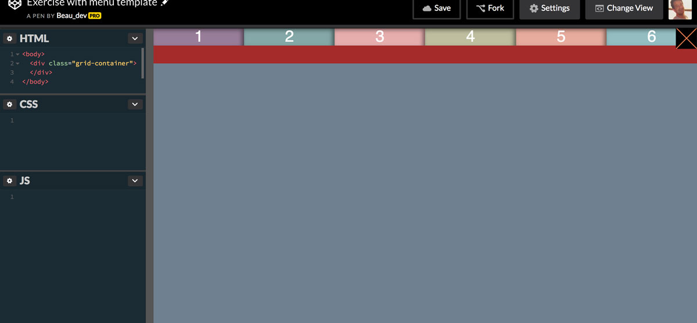
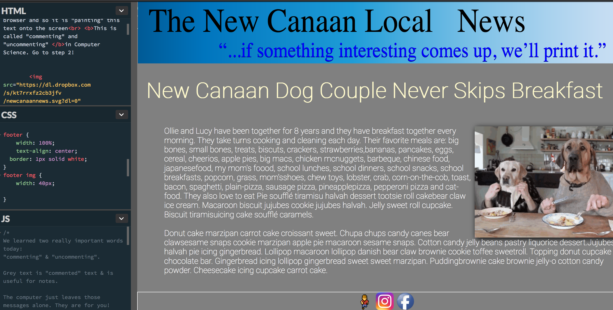
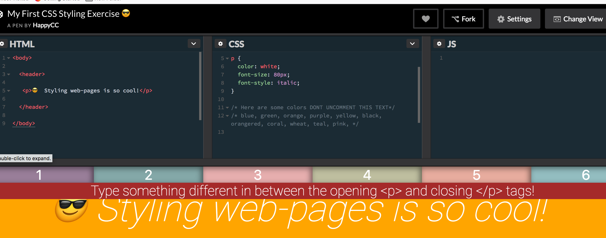
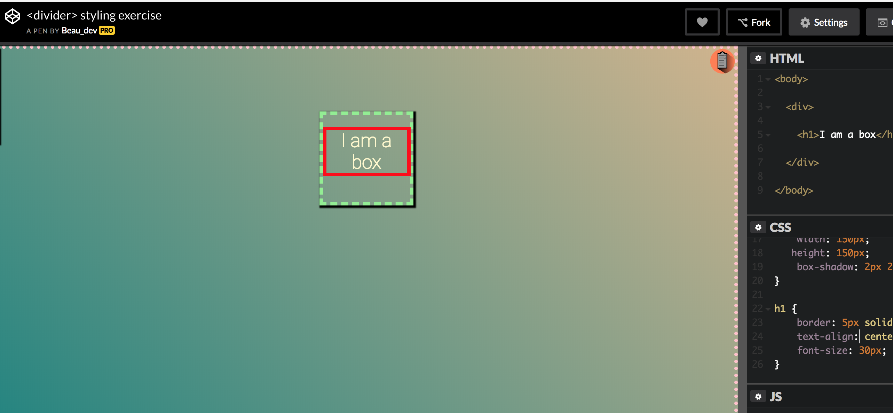

# codepen-exercises-for-HCC-students
A collection of exercises for JS/CSS/HTML with codepen integration


### I. HCC codepen template 

*[link to pen](https://codepen.io/happycodeclub/pen/OvmjpV)*

This code contains a template with animated menu for usability within codepen.

Much of the code is "hidden" in the "Stuff for Head" section of the Settings in Codepen.

There is a steps object in which you may enter directions for students that will toggle (upon btn click) directly in the pen:

```javascript
 /**********Directions TEXT**********/
var steps = {
    step1: "Put your right foot in",
    step2: "Put your right foot out",
    step3: "Put your right foot in",
    step4: "And you shake it all about",
    step5: "Do the Hokey-Pokey and you turn yourself around",
    step6: "*CLAP* That's what it's all about"
};
```

*(These steps are entered in the "Stuff for Head" box in codepen settings.)*



## Lesson I: Webcode/Codepen Intro Exercise



## Lesson II: First styling Exercise



## Lesson III: Divider styling Exercise



## Lesson VI: My Ugly Website


-----------

Happy Code Club Webcode Curriculum
3-30-18
─

### Mission
To provide students with an opportunity to explore and learn the core concepts used in code for the web: HTML CSS and Javascript. While this curriculum has no ambition to be exhaustive in its detail, emphasis will be placed upon the practicality, accessibility (to younger learners) and the most basic parts of Javascript.
Audience
As a pre-requisite, students will have had a few months (at least) in Scratch and will have reached a high-level of comfort with use of the browser, mouse & keyboard hotkeys  (i.e. “ctrl+c”, “ctrl+v”, etc.) 
Students will have some degree of maturity and ability to focus and follow step-by-step directions.
### Goals & Expectations
Having completed all of the modules of this class, students will have been exposed to and will have had the opportunity to implement core concepts of declarative code (html, css) and procedural programming in Javascript. They will have been given an opportunity to learn the core syntax of this Trio of webcode languages and be empowered to learn, experiment and create on their own.
### Materials
The majority of these classes will take place in the popular codepen.io platform. Each student will be assigned a personal account wherein he/she can create, save, explore on their own--during and long after class has been completed.
The initial class will acclimate students to the popular education-tool and coding playground https//codepen.io . It’s features and value as an educational tool cannot be overstated. It is not only a storehouse for prior projects, but these can be shared on twitter and “forked” or shared amongst other codepen members and will be a life-long coding platform for our students.
### Modules Overview
This curriculum delivers it’s lessons through 9 task-based “mini-projects” that will introduce and repeat many simple, core concepts (ie, syntax of CSS, HTML and Javascript, variables, error reports and a programmer’s response to bugs. Simple animations. Incrementing/decrementing values of a variable. The notion of how color is represented in code and web browsers generally.
Modules 


#### Lesson 1: 
Intro to Codepen Interface and Very basic CSS/HTML interaction
This day is dedicated to the idea that CSS & HTML work in tandem. One is for structure, one is for styling. Students are lead through step-by-step instructions in theirown codepen accounts. Example lessons are “forked” from happycodeclub’s codepen account, renamed, and saved to their own accounts. The cognitive load is high, so that many concepts must be repeated in the next class.
Lesson 1 collection

#### Lesson 2: 
Creating a website and styling basic HTML tags
This lesson explores manipulating pixel color, font-family, borders, margins, etc through guided lessons on editing “My Ugly Website” to make it look however the student wants it.
The first lesson is a pen that students can work on to reinforce the concepts learnt from the previous lesson: border styles, syntax, color manipulation, etc.
Lesson 2 collection

#### Lesson 3:
 “Fix this Weird Looking Pig”
This lesson continues the concepts of CSS←→ HTML connection. It further introduces the idea of an “event” in the browser that triggers some kind of action. CSS pseudo-selector :hover will be used to trigger action in the browser. A very light intro to animation will be teased in this lesson. SVG and <circle>, <path> elements will be used in the HTML.
Lesson 3 collection

#### Lesson 4:
 Enter Javascript
This project will introduce the idea of logic controlling & manipulating the DOM. Sounds and Animation will be triggered in the browser. Click on an animal, and a sound will play. Hover over another element and opacity or position will change. The jQuery library will control text elements and images to display and hide according to click events. Focus will be on the “<HTML>.on(“click”, function() {}). Cognitive load will be high and errors are to be expected.
Lesson 4 collection

#### Lesson 5: 
Javascript Animation:
Students, having been introduced to objects, will be able to use an if clause to trigger an animation. They will be creating and “drawing” balloons to the screen (in svg) and once they reach a certain number, the house will begin to fly -y values (up) & +x values (right). An <audio> html element will be triggered by a click event. They will be able to customize the speed and easings of the animation with numbers and javascript keywords used by the greensock.js animation library for vector graphics.
Lesson 5 collection
